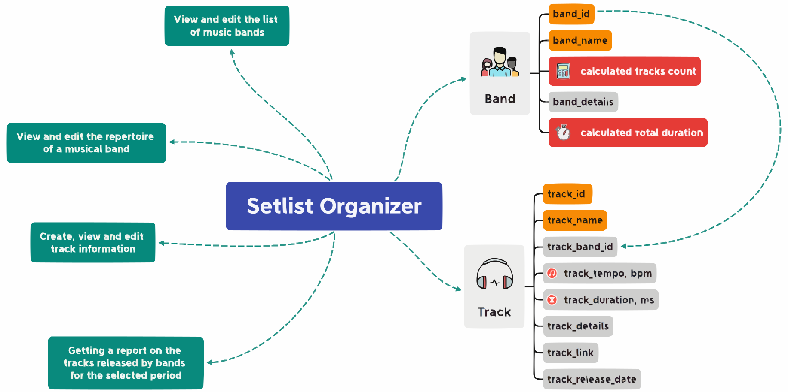
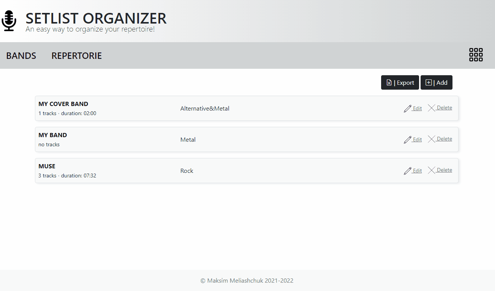
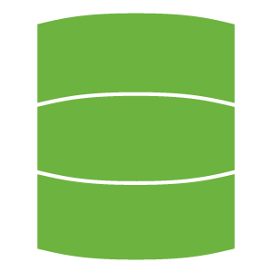

# <div align="center">  SETLIST ORGANIZER </div>
<div align="center">

[](https://git.io/typing-svg)

[](https://github.com/Brest-Java-Course-2021-2/Maksim-Meliashchuk-Setlist-Organizer/actions/workflows/maven.yml)
[](https://github.com/Brest-Java-Course-2021-2/Maksim-Meliashchuk-Setlist-Organizer/actions/workflows/codacy-analysis.yml)
[](https://opensource.org/licenses/Apache-2.0)


[](https://app.getpostman.com/run-collection/18999675-2eae966d-2b48-4890-91ff-a0d7f181caa6?action=collection%2Ffork&collection-url=entityId%3D18999675-2eae966d-2b48-4890-91ff-a0d7f181caa6%26entityType%3Dcollection%26workspaceId%3D56c614c7-7bb5-44fe-b171-746dba387b30)


[](https://setlist-organizer-rest.herokuapp.com/swagger-ui/index.html)
[](https://setlist-organizer-web.herokuapp.com/)


<sub>Built by <a href="https://github.com/Maxxx873">Maksim Meliashchuk</a>

</div>

## Table of contents

- [Project Information](#project-information)
- [Running example](#running-example)
- [Applications Demo](#applications-demo)
- [Technology Stack](#technology-stack)
- [Requirements](#requirements)
- [Installation Information](#installation-information)
- [Rest app configure](#rest-app-configure)
- [Web app configure](#web-app-configure)
- [Security](#security)
- [Run local tests](#run-local-tests)
- [Run mutation testing](#run-mutation-testing)
- [Run load testing](#run-load-testing)
- [Run application with PostgreSQL](#run-application-with-postgresql)
- [Run with docker-compose](#run-with-docker-compose)
- [Local tests with Postman](#local-tests-with-postman)
- [Documenting a REST API](#documenting-a-rest-api)
- [OpenAPI generated server](#openapi-generated-server)
- [Swagger generated client](#swagger-generated-client)
- [Excel Import and Export](#excel-import-and-export)
- [Generate test data](#generate-test-data)
- [Create and restore database archive](#create-and-restore-database-archive)

## Project Information

:studio_microphone: 'Setlist Organizer' is a web application for organizing repertoires of musical bands. :studio_microphone:

<details>
<summary>Mind Map</summary>
  <p align="center">
    
  </p>
</details>

- [Software requirements specification](documentation/SetlistOrganizerSRC.md)
- [Available REST endpoints](documentation/SetlistOrganizerEndpoints.md)
- [Presentation](documentation/SetlistOrganizer.pdf)

:warning: _<sub>Note: the Mind map, Software requirements specification, Available REST endpoints and Presentation 
describe the basic version of the project.The project is constantly being improved and developed.
The features of the current version of the project may differ from the information in this section.
See the following sections in this README for up-to-date project information.</a>_ :warning:

## Running example



## Applications Demo

Applications deployed on [Heroku](https://heroku.com/) <a href="https://heroku.com" target="_blank" rel="noreferrer">  </a>

The web application will be accessible at:

[https://setlist-organizer-web.herokuapp.com/](https://setlist-organizer-web.herokuapp.com/)

The rest application will be accessible at:

[https://setlist-organizer-rest.herokuapp.com/](https://setlist-organizer-rest.herokuapp.com/bands)

API documentation with Swagger UI:

[https://setlist-organizer-rest.herokuapp.com/swagger-ui/index.html](https://setlist-organizer-rest.herokuapp.com/swagger-ui/index.html)

## Technology Stack

- **Programming Language:** [Java](https://www.java.com) 
<a href="https://www.java.com" target="_blank">  </a>
- **Core Framework:** [Spring boot](https://spring.io/projects/spring-boot)
  
- **Data Access:** 
  - [Spring JDBC](https://docs.spring.io/spring-framework/docs/5.3.x/reference/html/data-access.html#jdbc)
   <a href="https://docs.spring.io/spring-framework/docs/5.3.x/reference/html/data-access.html#jdbc)" target="_blank" rel="noreferrer">  </a>
  - [Spring Data JPA](https://spring.io/projects/spring-data-jpa)
    
- **Security:** [Spring Security](https://spring.io/projects/spring-security)  
- **Identity Management:** [Keycloak](https://www.keycloak.org/) 
- **Validation Framework:** [Hibernate Validator](https://hibernate.org/validator/) 
- **Annotation processor:**
  - [Lombok](https://projectlombok.org/) 
  - [MapStruct](https://mapstruct.org/) 
- **Build System:** [Maven](https://maven.apache.org/) 
- **Control System:** [Git](https://git-scm.com/) <a href="https://git-scm.com/" target="_blank" rel="noreferrer">  </a>
- **License:** [Apache license, version 2.0](http://www.apache.org/licenses/LICENSE-2.0)
- **Code Style:** [Codacy](https://www.codacy.com/) 
- **Automated Testing:**
    - [JUnit5](https://junit.org/junit5/) 
    - [Mockito](http://site.mockito.org/) 
- **Mutation Testing:** [PIT](https://pitest.org/) 
- **Load Testing:** [Gatling](https://gatling.io/) 
- **Log:** 
  - [Log4j 2](https://logging.apache.org/log4j/2.x/)
  - [Logback](https://logback.qos.ch/)
  - [SLF4J](https://www.slf4j.org/)
- **Monitoring:**
  - [Micrometer](https://micrometer.io/)
  - [Prometheus](https://prometheus.io/) 
  - [Grafana](https://grafana.com/) 
- **Database:** 
  - [H2](http://www.h2database.com/html/main.html) 
  - [PostgreSQL](https://www.postgresql.org/) <a href="https://www.postgresql.org" target="_blank" rel="noreferrer">  </a>
- **Database migration tool:** [Flyway](https://flywaydb.org/) 
- **JSON library:** 
  - [Jackson](https://github.com/FasterXML/jackson)
  - [GSON](https://github.com/google/gson)
- **Generate test data:** [Java Faker](https://github.com/DiUS/java-faker)
- **Java API for Microsoft Excel:** [Apache POI](https://poi.apache.org/components/spreadsheet/)
- **API documentation generation:**
  - [Springdoc-openapi](https://springdoc.org/) 
  - [Swagger UI](https://swagger.io/tools/swagger-ui/) 
- **Code generation:**
  - [OpenAPI Generator](https://openapi-generator.tech) 
  - [Swagger Codegen](https://github.com/swagger-api/swagger-codegen) 
- **Template Engine:** [Thymeleaf](https://www.thymeleaf.org/) 
- **CSS Framework:** [Bootstrap](https://getbootstrap.com/) <a href="https://getbootstrap.com" target="_blank" rel="noreferrer">  </a>
- **App containerization:** [Docker](https://www.docker.com/) <a href="https://www.docker.com/" target="_blank" rel="noreferrer">  </a>

## Requirements

The following software is required for the complete workflow (from git clone to the running Docker Container). 
The specified versions are the tested ones. 

* JDK 11+
* Git 2.25.1+
* Apache Maven 3.6.3+
* Docker 20.10.12+
* Docker-compose 1.29.2+
* Scala-sdk 2.13.6+ (for load testing)

## Installation Information

```bash
  $ git clone https://github.com/Brest-Java-Course-2021-2/Maksim-Meliashchuk-Setlist-Organizer.git
  $ cd Maksim-Meliashchuk-Setlist-Organizer
  $ mvn clean install
```

## Rest app configure

Setup [rest-app](/rest-app) in [application.yaml](/rest-app/src/main/resources/application.yaml):

| Profile    | Description                                                                    |
|------------|--------------------------------------------------------------------------------|
| *dev*      | Run application with embedded H2 database in memory                            |
| *postgres* | Run application with PostgreSQL database                                       |
| *test*     | Run application with embedded H2 database in memory, Flyway migration disabled |
| *jdbc*     | Interact with a database by using Spring JDBC                                  |
| *jpa*      | Interact with a database by using Spring Data JPA                              |

Example:
```
spring.profiles.active=dev, jpa
```

## Web app configure

The web application has three web client implementations for making HTTP calls to 
REST application services - RestTemplate, a new WebClient alternative and automatically generated by the 
[Swagger Codegen](https://github.com/swagger-api/swagger-codegen) client API - 
[ApiClient](service-swagger-client/README.md).
Setup web-app in [application.yaml](/web-app/src/main/resources/application.yaml).

Using **RestTemplate** (is deprecated since Spring 5):
```bash
app.httpClient = RestTemplate
```
Using **WebClient** (exists since Spring 5):
```bash
app.httpClient = WebClient
```
Using **ApiClient** ([OkHttpClient](https://square.github.io/okhttp/) and [GSON](https://github.com/google/gson) based):
```bash
app.httpClient = ApiClient
```

**ApiClient** is a preferable choice.

:warning: _<sub>Note: this Web application has endpoints for using create and import Excel, XML, ZIP files with 
the 'ApiClient' property only.</a>_ :warning:

## Security


This project uses the [OpenID Connect](https://openid.net/connect/)  support in [Spring Security 5](https://spring.io/projects/spring-security) 
and [Keycloak](https://www.keycloak.org/) as the OpenID Connect Identity Provider 
without using the [Keycloak adapter](https://www.keycloak.org/2022/02/adapter-deprecation).  
Only authenticated users can call secured endpoints available through Swagger UI and the web-app UI.

You can run the `Keycloak` container with the following commands in the root directory of the project:

```bash
$ sudo docker-compose -f keycloak.yml up
```

`Keycloak` is assumed to run on port 8484 on localhost.
The `Keycloak` service can be started with a default realm by importing it from the [keycloak/realm-export.json](keycloak/realms/realm-export.json) 
file which lists default users.
For example users of this project:
- available usernames: `admin1`, `user1`
- password: `123`

`admin1` has the `admin` realm role that is required to call the POST and DELETE.

## Run local tests

Embedded H2 in memory.

In the root directory of the project:
```bash
$ java -jar -Dspring.profiles.active=dev,jpa rest-app/target/rest-app-1.0-SNAPSHOT.jar
```
To start the OpenAPI generated server:
```bash
$ java -jar -Dspring.profiles.active=dev,jpa rest-app-openapi/target/rest-app-openapi-1.0-SNAPSHOT.jar
```
The rest application will be accessible at [http://localhost:8088](http://localhost:8088).
```bash
$ java -jar web-app/target/web-app-1.0-SNAPSHOT.jar 
```
The web application will be accessible at [http://localhost:8080](http://localhost:8080).

## Run mutation testing

[PIT](https://pitest.org/) runs unit tests against automatically modified versions of the application code, 
the most effective way to use mutation testing is to run it frequently against only the code that has been changed.
TargetClasses and TargetTests to limit the tests available to be run added to parent project POM:

```xml
<configuration>
  <targetClasses>
      <param>com.epam.brest.service.impl.jpa.*</param>
  </targetClasses>
  <targetTests>
      <param>com.epam.brest.service.impl.jpa.*</param>
  </targetTests>
</configuration>
```

Run directly from the commandline:
```bash
$ mvn test-compile org.pitest:pitest-maven:mutationCoverage
```
PIT Test Coverage Report will be accessible: ```/service/target/pit-reports/index.html)```

## Run load testing


Testing starts with 10 users per second making two requests to the repertoire, holding at that concurrency 
for five seconds. Then [RestSimulationLocal](/gatling-test/src/test/scala/simulation/RestSimulationLocal.scala) test scenario increases 
the number of users per second by 5, 5 times, holding for 5 seconds each time. 
Every request must return an HTTP 200 status code to pass the test.
Run the test in the root directory of the project:

```bash
$ sh gatling-test.sh
```
Make sure the rest-app at [http://localhost:8088](http://localhost:8088) is running.
Gatling reports generated in: ```/gatling-test/target/gatling/```

## Run application with PostgreSQL


PostgreSQL require(can be customized in application-postgres.yaml file in prod-db module):
* `driver` - org.postgresql.Driver
* `url` - jdbc:postgresql://localhost:5432/setlistOrganizer
* `user` - postgres
* `password` - password
  
Run rest-app with PostgreSQL:
```bash
$ java -jar -Dspring.profiles.active=postgres,jpa rest-app/target/rest-app-1.0-SNAPSHOT.jar
```

## Run with docker-compose


In the root directory of the project, run the rest-app with monitoring and web-app in one go:
```bash
$ sudo docker-compose up --build
```
The web application will be accessible at [http://localhost:8080](http://localhost:8080)

The rest application will be accessible at [http://localhost:8088](http://localhost:8088)

The PostgreSQL database can be accessed in docker at: [http://localhost:5432](http://localhost:5432)

Micrometer by default shows jvm metrics at [http://localhost:8088/actuator/prometheus](http://localhost:8088/actuator/prometheus)


Access the Prometheus webUI on  [http://localhost:9090](http://localhost:9090)


Access the Grafana webUI with jvm-micrometer dashboard on  [http://localhost:3000](http://localhost:3000)

To stop the containers:
```bash
$ sudo docker-compose down
```

## Local tests with Postman


To test the REST API, you can use the Postman collection to access the API endpoints:

[postman_collection.json](./documentation/Setlist_organizer_rest_app.postman_collection.json)

See the Postman [online documentation](https://learning.postman.com/docs/getting-started/installation-and-updates/).

## Documenting a REST API

Using OpenAPI 3.0

The OpenAPI descriptions in JSON format will be available at the path: 
[http://localhost:8088/v3/api-docs](http://localhost:8088/v3/api-docs)

The OpenAPI descriptions in YAML format will be available at the path:
[http://localhost:8088/v3/api-docs.yaml](http://localhost:8088/v3/api-docs.yaml)

API documentation with Swagger UI: 
[http://localhost:8088/swagger-ui/index.html](http://localhost:8088/swagger-ui/index.html)

Click the `Authorize` button and log in as an example user of the `setlist_organizer_client` client to test secured
endpoints, the client is `public` so you don't need to fill the `client_secret` field.

## OpenAPI generated server


Automatically generated by the [OpenAPI Generator](https://openapi-generator.tech) project
by using the [OpenAPI-Spec](https://openapis.org) and the [openapi-generator-maven-plugin](https://github.com/OpenAPITools/openapi-generator/tree/master/modules/openapi-generator-maven-plugin/README.md).

An OpenAPI document that conforms to the OpenAPI Specification [openapi.yaml](rest-app-openapi/src/main/resources/openapi.yaml)
has been generated automatically by using [springdoc-openapi-maven-plugin](https://github.com/springdoc/springdoc-openapi-maven-plugin)
in the module [rest-app](rest-app).

*Refer to the module [rest-app-openapi](rest-app-openapi/README.md) for more information.*

## Swagger generated client


Automatically generated by the [Swagger Codegen](https://github.com/swagger-api/swagger-codegen) by using the
[swagger-codegen-maven-plugin](https://github.com/swagger-api/swagger-codegen/blob/master/modules/swagger-codegen-maven-plugin/README.md).

An OpenAPI document that conforms to the OpenAPI Specification [openapi.yaml](rest-app-openapi/src/main/resources/openapi.yaml)
has been generated automatically by using [springdoc-openapi-maven-plugin](https://github.com/springdoc/springdoc-openapi-maven-plugin)
in the module [rest-app](rest-app).

*Refer to the module [service-swagger-client](service-swagger-client/README.md) for more information.*

## Excel Import and Export


These REST applications have several endpoints (`/export/excel` and `/import/excel`) to create and import Excel files using 
[Apache POI](https://poi.apache.org/components/spreadsheet/).

*Please, after running the REST application, refer to the API documentation with [Swagger UI](http://localhost:8088/swagger-ui/index.html) for more information.*

Following are samples of Excel files that can be imported:

[Band.xlsx](./documentation/Band.xlsx) 
[Track.xlsx](./documentation/Track.xlsx)

## Generate test data

These REST applications have several endpoints `/fill` to generate fake data for showcase with uses [Java Faker](https://github.com/DiUS/java-faker).
It is possible specify language for generated data (EN, DE, FR), default EN.
It is possible specify count fakes data, use parameter to multiply default size (default value 1).

*Please, after running the REST application, refer to the API documentation with [Swagger UI](http://localhost:8088/swagger-ui/index.html) for more information.*

## Create and restore database archive

The database archive can be created and exported in XML format and saved as a ZIP archive.
These REST applications have a `/downloadZipFile` endpoint with the ability to create a database archive and a `/uploadZipFile` endpoint
with the ability to restore the database from the archive.
The Simple API for XML (SAX) is used to parse XML documents.

The following is an example of a ZIP file that is the result of an export that can be imported:

[database.zip](./documentation/database.zip)