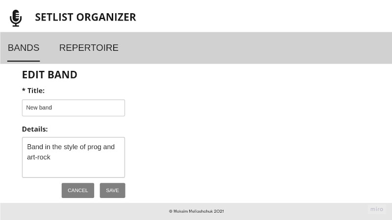

# Software requirements specification
## SetList Organizer Application

* [Purpose](#purpose)
* [Functions](#functions)
- [1. Bands](#1-bands)
    * [1.1. Viewing the list of music bands](#11-viewing-the-list-of-music-bands)
    * [1.2. Adding the band](#12-adding-the-band)
    * [1.3. Editing the band](#13-editing-the-band)
    * [1.4. Deleting the band](#14-deleting-the-band)
- [2. Repertoire](#2-repertoire)
    * [2.1. Viewing the repertoire](#21-viewing-the-repertoire)
    * [2.2. Filtering the repertoire](#22-filtering-the-repertoire)
    * [2.3. Adding a track](#23-adding-a-track)
    * [2.4. Editing a track](#24-editing-a-track)
    * [2.5. Deleting a track](#25-deleting-a-track)

### Purpose 

A web application is needed to manage band repertoires and help musicians create setlists for concerts and rehearsals.

### Functions

- View and edit the list of music bands
- View and edit the repertoire of a musical band
- Create, view and edit track information
- Getting a report on the tracks released by bands for the selected period

## 1. Bands
### 1.1. Viewing the list of music bands

The mode is intended for viewing the list of created music bands and adding new bands.
The main scenario:
- The user selects the "Bands" menu item
- The form for viewing the list of bands is displayed

The following fields are displayed:
- Band name
- Details about the band
- The number of tracks in the band's repertoire. If there are no tracks, label "no tracks" is output
- Duration of the repertoire of the band

  Viewing the list of bands

### 1.2. Adding the band

The main scenario:
- The user, being in the mode of viewing the bands, clicks the “Add” button
- The form for adding a new band is displayed
- If the data is correct, the information about the new band is written to the database
- If an error occurs during saving, an error message about data saving is displayed
- If the band has been successfully added, a form for viewing bands with updated data opens

Adding cancellation scenario:
- The user, being in the bands viewing mode, clicks the “Add” button
- The form for adding a new band is displayed
- The user clicks the "Cancel" button
- Information about the band is not saved to the database, a form for viewing bands with updated data opens

When adding the band, the following values are entered:
- `name` - required name of the band;
- `details` - additional optional information about the band

  Adding the band

### 1.3. Editing the band

Basic scenario:
- The user, being in the bands viewing mode, presses the “Edit” button in the line of the required band.
- The form for editing the band is displayed.
- The user changes the data and clicks the “Save” button.
- If the data is correct, the updated band information is written to the database.
- If an error occurs while saving, a data save error message is displayed.
- If the band has been successfully updated, a form for viewing bands with updated data will open

Undo scenario:
- The user, being in the bands view mode, presses the "Edit" button.
- The form for adding a new band is displayed.
- The user clicks the "Cancel" button.
- Information about the band is not saved to the database, a form for viewing bands with updated data opens.

When editing the band, the following values are entered:
- `name` - required name of the band;
- `details` - additional optional information about the band

Constraints for data validation:
- `name` - no more than 100 characters. The value must be unique in the database
- `details` - no more than 1000 characters. This field is optional

  Editing the band

### 1.4. Deleting the band

Basic scenario:
- The user, being in the bands viewing mode, presses the “Delete” button in the line of the required band.
- A confirmation dialog box for deletion is displayed. "Are you sure you want to delete the band <band name>?"
- The user clicks the "Yes" button.
- The band entry is removed from the database if there are no tracks associated with the band. If an error occurs during the operation, an error message is displayed.
- If an error occurs during the operation, an error message is displayed.
- If the band has been successfully deleted, a form for viewing bands with updated data opens.

Cancellation scenario:
- The user, being in the band viewing mode, presses the “Delete” button in the row of the required band.
- A confirmation dialog box for deletion is displayed. "Are you sure you want to delete the band <band name>?"
- The user clicks the "No" button.
- A form for viewing bands with updated data opens.

  Confirmation of deleting the band

## 2. Repertoire

### 2.1. Viewing the repertoire

The mode is intended for viewing the repertoire of the bands.
Basic scenario:
- The user selects the "Repertoire" menu item
- The repertoire of bands is displayed

The following fields are displayed in the list:
- Track name
- Band name of the track
- Track duration in minutes and seconds
- Track details
- The tempo of the track in bpm
- Release date of the track. If the release date of the track is not specified, an empty field is displayed
- Link to track

  Viewing the repertoire

Second scenario:
- The user clicks on the band's name in the bands view
- The repertoire of select band is displayed

The following fields are displayed in the list:
- Tracks count
- Total duration of the repertoire in minutes and seconds
- Track name
- Band name of the track
- Track duration in minutes and seconds
- Track details
- The tempo of the track in bpm
- Release date of the track. If the release date of the track is not specified, an empty field is displayed
- Link to track

### 2.2. Filtering the repertoire

Filtering is designed to get a list of tracks, the release date of which falls within the selected period.
Basic scenario:
- The user selects the start date of the period
- The user selects the end date of the period
- The user clicks the "Submit" button
- A	list of tracks whose release date falls within the specified period is displayed

Constraints for data validation:
- If no data is entered, no filtering is performed - the entire list of tracks is shown
- If no start date value is entered, then filtering is performed only by the end date
- If no end date is entered, then filtering is carried out only by the start date
- By default, the filter with dates is not set - the entire list of tracks is shown

### 2.3. Adding a track

Main scenario:
- The user, being in the repertoire viewing mode, presses the “Add” button
- The form for adding a new track is displayed
- If the data is correct, the information about the new track is written to the database
- If an error occurs while saving, a data save error message is displayed
- If the track has been successfully added, the repertoire viewing form with updated data will open

Undo scenario:
- The user, being in the repertoire viewing mode, presses the "Add" button
- The form for adding a track is displayed
- The user clicks the "Cancel" button
- Information about the track is not saved to the database, a form for viewing the repertoire with updated data opens

  Adding the track

When adding the track, the following values are entered:
- `name` - required name of the track
- `band` - name of the band of the track from list of bands
- `tempo` - track tempo, value in bpm
- `details` - additional information about the track
- `release date` - track release date
- `duration` - duration of the track play in minutes and seconds
- `link` - the link to the track if it is posted on the web

### 2.4. Editing a track

Main scenario:
- The user, being in the repertoire viewing mode, presses the "Edit" button
- The track edit form is displayed
- The user changes the data and clicks the “Save” button
- If the data is correct, the track information is updated in the database
- If an error occurs while saving, a data save error message is displayed
- If the track is updated, a form for viewing the repertoire with updated data opens

Undo scenario:
- The user, being in the repertoire viewing mode, presses the "Edit" button
- The track edit form is displayed
- The	user clicks the "Cancel" button
- Information about the track is not saved to the database, a form for viewing the repertoire with updated data opens

When editing the track, enter the following values:
- `name` - name of the track
- `band` - name of the band of the track from list of bands
- `tempo` - track tempo, value in bpm
- `details` - additional information about the track
- `release date` - track release date
- `duration` - duration of the track play in minutes and seconds
- `link` - the link to the track if it is posted on the web

Constraints for data validation:
- `name` - a character field, no more than 100 characters long
- `tempo` - value in bpm (integer number)
- `details` - character field no more than 2000 characters
- `duration` - integer number of minutes and integer number of seconds
- `link` - a symbolic field, the URL of the track, if it is posted on the web. The character field is no more than 255 characters.
  Contains protocol `http://` or `https://`

  Editing the track

### 2.5. Deleting a track

Main scenario:
- The user, being in the track viewing mode, presses the "Delete" button in the line of the desired track
- A confirmation dialog box for deletion is displayed. "Are you sure you want to delete the track <track name>?"
- The	user clicks the "Yes" button
- The track entry is removed from the database
- If an error occurs during the operation, an error message is displayed.
- If the track was successfully deleted, a form for viewing the repertoire with updated data opens.

Undo scenario:
- The user, being in the track view mode, presses the "Delete" button in the line of the desired band
- A confirmation dialog box for deletion is displayed. "Are you sure you want to delete the track <track name>?"
- The user clicks the "No" button
- A form for viewing tracks with updated data opens

  Deleting the track

